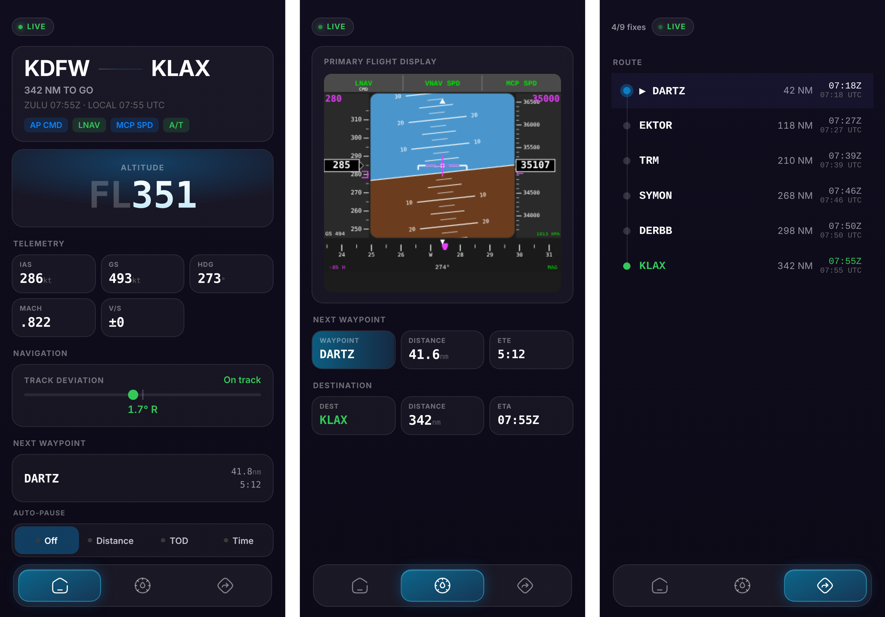

# PFD Companion

A primary flight display for your phone while you fly in Microsoft Flight Simulator or X-Plane 12.

A Python bridge on the PC reads live flight data from the sim and serves a web app you add to your iPhone home screen. It shows a canvas-drawn PFD, flight data, autopilot mode annunciations, and your SimBrief route with the active waypoint.

<!-- Add a screenshot of the app running on your phone here -->
<!--  -->

## How it works

```
Flight sim  ->  SimConnect (MSFS) or UDP (X-Plane 12)  ->  Flask bridge (msfs_bridge.py)
            ->  Cloudflare Tunnel  ->  Cloudflare Worker (permanent URL)  ->  iPhone (pfd.html)
```

- **Bridge (`msfs_bridge.py`):** Flask backend. Reads telemetry from MSFS through SimConnect or from X-Plane 12 over UDP, whichever sim is running. Fetches the flight plan from SimBrief, sequences waypoints, and handles login sessions.
- **Display (`pfd.html`):** a single-file web app in plain HTML, CSS and JavaScript with no build step. The PFD is drawn on a canvas at 60 fps and interpolates between data updates so the tapes and attitude indicator move smoothly. It has Home, PFD and Route screens.
- **Transport:** WebSockets, with HTTP polling every 200 ms as a fallback.
- **Remote access:** a Cloudflare Tunnel exposes the bridge so the phone doesn't need to be on the same network. A Cloudflare Worker (`cloudflare-worker.js`) reverse-proxies a fixed URL to the current tunnel, so the home-screen bookmark never changes.
- **Launcher (`launch_pfd.ps1`):** a Windows tray app that starts the bridge and tunnel, registers the tunnel with the Worker, and shows the login password.

## Setup

1. Install Python 3.12+ and the dependencies:
   ```
   pip install -r requirements.txt
   ```
2. Copy `config.example.json` to `config.json` and fill in your SimBrief username and Worker URL.
3. Download [`cloudflared`](https://developers.cloudflare.com/cloudflare-one/connections/connect-networks/downloads/) into this folder.
4. Deploy `cloudflare-worker.js` as a Cloudflare Worker. The comment at the top of the file walks through it.
5. Run `launch_pfd.ps1`, open the Worker URL on your phone, log in with the password shown in the tray window, and add it to your home screen.

To run just the bridge on your local network, use `python msfs_bridge.py` and open `http://<your-pc-ip>:5000`.

## Notes

- The login password is generated on first run and stored in `auth_token.txt`, which is not committed.
- X-Plane 12 support is protocol-verified but not yet tested against a live X-Plane session.

## License

MIT
